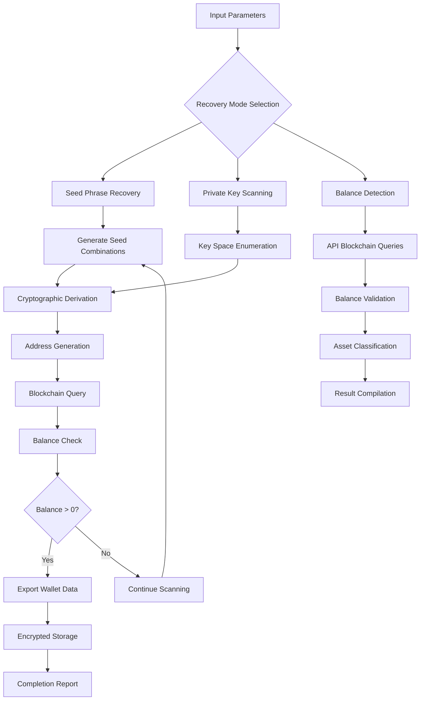

# 🎯 Crypto Wallet Recovery Toolkit 26

**WalletBrutePro** is a high-performance cryptocurrency wallet recovery and discovery platform designed for legitimate recovery operations, security auditing, and blockchain research. Built on optimized C++ architecture with GPU acceleration, it provides enterprise-grade performance for recovering lost wallet credentials and discovering inactive accounts with residual balances.

> [!IMPORTANT]
> This tool is intended solely for legitimate recovery operations on wallets you legally own. Using wallet recovery software on assets you don't own constitutes illegal activity and violates applicable laws.
>

## 🔍 Core Features Overview

### Multi-Network Balance Scanning
- **45+ Blockchain Networks**: Native support for Bitcoin, Ethereum (EVM), BNB Chain, Polygon, Solana, Tron, and emerging layer-2 networks
- **Real-time API Integration**: Direct connectivity to blockchain nodes and indexer APIs for live balance verification
- **Smart Contract Detection**: Automated identification of DeFi positions, staking, and yield farming assets

### Advanced Brute Force Engine
- **GPU-Accelerated Computation**: OpenCL/CUDA optimization for cryptographic operations (PBKDF2-SHA512, AES-256)
- **Multi-threaded Architecture**: Parallel processing across CPU cores and GPU threads for maximum throughput
- **Intelligent Search Patterns**: Context-aware permutation generation with dictionary optimization

### Recovery Methodologies
- **BIP39 Seed Phrase Recovery**: Supports 12, 15, 18, 21, and 24-word mnemonic phrases with checksum validation
- **Partial Seed Reconstruction**: Recover complete phrases from known word fragments (minimum 60% known)
- **Private Key Space Exploration**: Systematic scanning of cryptographic key ranges with statistical analysis
- **Brain Wallet Dictionary**: Custom wordlists and pattern-based passphrase generation

### Security & Privacy Framework
- **Local Processing**: All cryptographic operations performed locally—no data transmission to external servers
- **Air-Gapped Mode**: Functionality in completely offline environments for maximum security
- **Encrypted Storage**: AES-256 encrypted result caching and session persistence

> [!NOTE]
> **Accessibility Features**: Full keyboard navigation, screen reader compatibility, and adjustable interface scaling available in advanced settings.

## 🔄 Operational Workflow Diagram

## ❓ Frequently Asked Questions

### 🔐 Is This Tool Legal?
**WalletBrutePro** is legal when used for recovering your own lost wallets, auditing your security infrastructure, or conducting authorized security research. It's illegal to use it on wallets you don't own. The tool includes built-in compliance checks and logging for audit trails.

### ⚙️ What Performance Can I Expect?
Performance varies by hardware:
- **CPU-only**: 500-2,000 seeds/second (modern multi-core)
- **GPU-accelerated**: 50,000-200,000 seeds/second (RTX 4080/4090)
- **Multi-GPU Cluster**: Up to 1M+ seeds/second (enterprise setups)

### 🔄 How Often Are Networks Updated?
The database receives weekly updates for:
- New blockchain networks
- API endpoint rotations
- Smart contract ABIs
- Token metadata and pricing feeds

### 📁 What Formats Are Supported for Results?
Results export in multiple formats:
- **JSON**: Structured data for programmatic processing
- **CSV**: Spreadsheet-compatible for analysis
- **Encrypted TXT**: Secure storage with password protection
- **Wallet.dat**: Direct import to compatible wallet software

### 🔧 Can I Customize Search Parameters?
Yes, extensive customization includes:
- Network-specific derivation paths
- Custom wordlists and dictionaries
- Hardware utilization limits
- API rate limiting configuration
- Output filtering thresholds

### 🛡️ What Security Measures Are In Place?
- Local-only processing (no cloud dependencies)
- Encrypted configuration files
- Session-based temporary storage
- Automatic cleanup of sensitive data
- Audit logging with integrity checks

## 🚀 Getting Started Today

Ready to begin legitimate wallet recovery operations? Follow these steps:

1. **Verify Ownership**: Ensure you have legal rights to target wallets
2. **Prepare Hardware**: Configure GPU drivers and system libraries
3. **Secure Environment**: Run in isolated, air-gapped systems when possible
4. **Start Scanning**: Begin with conservative parameters and monitor results

For enterprise deployments, consult our professional services for custom integration, compliance frameworks, and high-availability setups.

---
